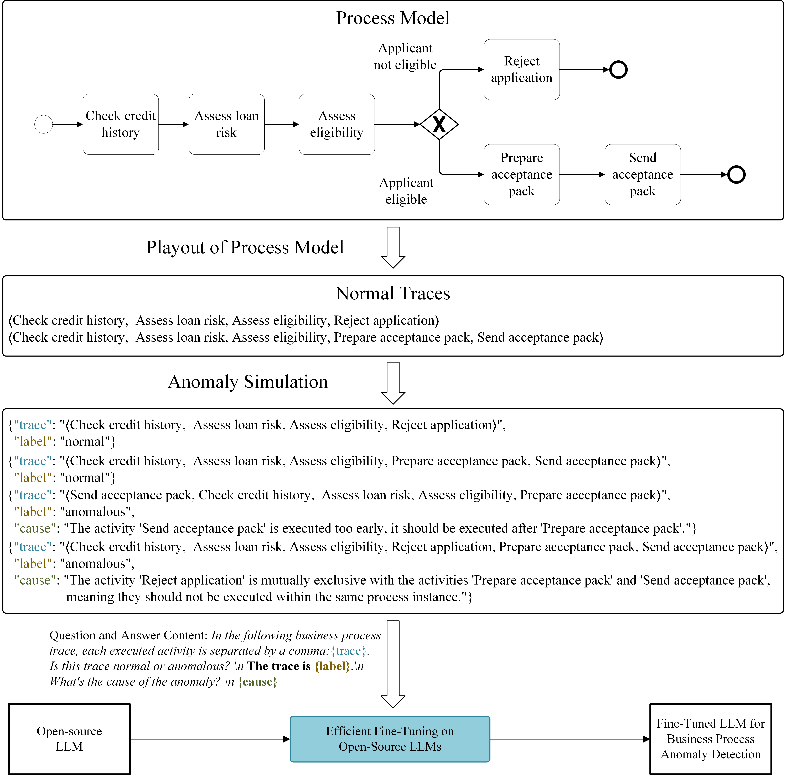

# DABL: Detecting Semantic Anomalies in Business Processes Using Large Language Models

Detecting anomalies in business processes is crucial for ensuring operational success. While many existing methods rely
on statistical frequency to detect anomalies, it's important to note that infrequent behavior doesn't necessarily imply
undesirability. To address this challenge, detecting anomalies from a semantic viewpoint proves to be a more effective
approach. However, current semantic anomaly detection methods treat a trace (i.e., process instance) as multiple event
pairs, disrupting long-distance dependencies. In this paper, we introduce DABL, a novel approach for detecting semantic
anomalies in business processes using large language models (LLMs). We collect 143,137 real-world process models from
various domains. By generating normal traces through the playout of these process models and simulating both ordering
and exclusion anomalies, we fine-tune Llama 2 using the resulting log. Furthermore, DABL offers the capability to
interpret the causes of anomalies in natural language, providing valuable insights into the detected anomalies. Through
extensive experiments, we demonstrate that DABL surpasses existing state-of-the-art semantic anomaly detection methods
in terms of both generalization ability and learning of given processes. Additionally, users can directly apply DABL to
detect semantic anomalies in their own datasets without the need for additional training.


## Datasets

To effectively fine-tune LLMs for developing a generic model capable of detecting semantic anomalies in business
processes, a log meeting the following criteria is imperative: i) it must encompass both normal and anomalous traces,
ii) it should contain rich semantic information (i.e., the activities should not be represented by meaningless
characters), and iii) the traces within it should stem from diverse processes across various domains. Since such a log
is not available in the real world, we generate normal traces by playout of the real-world process models from
the [BPM Academic Initiative (BPMAI)](https://zenodo.org/records/3758705)
, [fundamentals of business process management (FBPM)](http://fundamentals-of-bpm.org/process-model-collections/),
and [SAP signavio academic models (SAP-SAM)](https://zenodo.org/records/7012043). These process models cover a broad
range of domains, including common processes related to order and request handling, as well as specialized processes
from fields such as software engineering and healthcare. We then generate synthetic anomalies from these normal traces.

### Test Dataset

We allocate 1,000 process models for generating the test dataset $\mathcal{D}_1$. These models produce 14,387 normal
traces, and we randomly simulate anomalies, resulting in 13,694 anomalous traces. In total, the test dataset comprises
28,081 traces.

From 143,137 process models used for generating the training dataset, we randomly select 1,000 process models to create
the test dataset $\mathcal{D}_2$. These 1,000 process models produce 21,298 normal traces, and we randomly simulate
anomalies, resulting in 19,627 anomalous traces. In total, the test dataset comprises 40,925 traces. Note that, although
the normal traces within the test dataset $\mathcal{D}_2$ are identical to those in the training dataset, the simulated
anomalies are not.

In summary, the test dataset $\mathcal{D}_1$ is used to evaluate the model's generalization ability, verifying if the
model can detect anomalies of unseen processes. The test dataset $\mathcal{D}_2$ aims to validate the model's
performance on seen processes but unseen anomalies (i.e., learning of given processes).

## Experiment results

Semantic anomaly detection results on dataset $\mathcal{D}_1$. The best results are indicated using bold typeface.

|            | Prec.(\%) | Rec.(\%)  | F$_1$(\%) | Acc.(\%)  |
|:----------:|:---------:|:---------:|:---------:|:---------:|
| SEM        | 48.67     | 46.8      | 47.72     | 50.81     |
| SENSE-SVM  | 87.95     | 1.12      | 2.20      | 52.50     |
| SENSE-BERT | 48.17     | **97.74** | 64.53     | 48.47     |
| DBAL       | **94.06** | 89.79     | **91.88** | **92.39** |

Semantic anomaly detection results on dataset $\mathcal{D}_2$. The best results are indicated using bold typeface.

|            | Prec.(\%) | Rec.(\%)  | F$_1$(\%) | Acc.(\%)  |
|:----------:|:---------:|:---------:|:---------:|:---------:|
| SEM        | 71.91     | 48.63     | 58.02     | 66.75     |
| SENSE-SVM  | 90.28     | 28.64     | 43.49     | 64.82     |
| SENSE-BERT | 93.16     | 62.88     | 75.08     | 80.28     |
| DBAL       | **98.12** | **95.64** | **96.87** | **97.03** |

## Using Our Code to Reproduce the Results


1. Create conda environment.  

```
 conda install --yes --file requirements.txt # You may need to downgrade the torch using pip to match the CUDA version
```

2. Download the process model datasets and save them to `/dataset/process_model`

- [BPM Academic Initiative (BPMAI)](https://zenodo.org/records/3758705)
- [fundamentals of business process management (FBPM)](http://fundamentals-of-bpm.org/process-model-collections/)
- [SAP signavio academic models (SAP-SAM)](https://zenodo.org/records/7012043)

```
   ├── process_model      
   │ ├── BPMAI
   │ │ ├── description.txt 
   │ │ └── models
   │ ├── FBPM2-ProcessModels
   │ │ ├── Chapter1 
   │ │ ├── ...
   │ │ ├── Chapter11
   │ │ └── info.txt
   │ ├── sap_sam_2022
   │ │ ├── models
   │ │ ├── LICENSE.txt
   │ │ └── README.txt
```

3. Download open-source LLM [Llama-2-13b-chat-hf](https://huggingface.co/meta-llama/Llama-2-13b-chat-hf/tree/main), and
   save it to the root directory

```
   ├── llama-2-13b-chat-hf
   │ ├── config.json
   │ ├── generation_config.json
   │ ├── LICENSE.txt
   │ ├── model-00001-of-00003.safetensors
   │ ├── model-00002-of-00003.safetensors
   │ ├── model-00003-of-00003.safetensors
   │ ├── model.safetensors.index.json
   │ ├── special_tokens_map.json
   │ ├── tokenizer.json
   │ ├── tokenizer.model
   │ └── tokenizer_config.json
```

4. Generate Datasets
- Run ```python dataset_pre.py``` from the root directory.

4. Fine-tune Llama2. This step can be skipped by directly using our fine-tuned model (llama-13b-int4-dolly) 
- Run ```python fine-tune-BPAD.py``` from the root directory to get fine-tuned model (llama-13b-int4-dolly) 

5. Evaluate on test dataset.
- Run ```python eval-BPAD.py``` from the root directory. 

## Running Tests on the User's Own Real-World Event Log in '.xes' Format

1. Perform semantic anomaly detection by executing the following command from the root directory:

```
    python test_realLog.py --data_path dataset/BPIC20_PermitLog.xes
```

This command will directly apply our fine-tuned model (llama-13b-int4-dolly) to the user's real-world event log in '.xes' format.

We provide the zip files of real-world logs: '_BPIC20_PermitLog.zip_' and '_Road_Traffic_Fine_Management_Process.zip_'. 
After unzipping these files, you will obtain '_BPIC20_PermitLog.xes_' and '_Road_Traffic_Fine_Management_Process.xes_'. 
You can use these '.xes' files to conduct your tests.